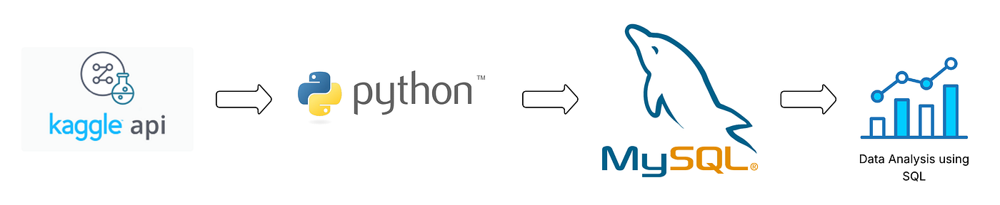

# 🛒 Walmart Data Analysis: End-to-End SQL + Python Project

<p align="center">
  
  
  
  
</p>

## 📌 Project Overview



This project delivers an **end-to-end data engineering and analytics solution** designed to extract critical operational insights from Walmart sales records. We leverage **Python** for programmatically downloading datasets, handling data processing, and cleaning, combined with **SQL (MySQL)** for executing advanced analytical queries to address fundamental business challenges. 

> **🎯 Target Audience:** Ideal for data professionals looking to master automated ingestion pipelines, dynamic feature engineering, database mapping via `SQLAlchemy`, and complex relational querying.

---

## 🛠️ Tech Stack & Requirements

*   **Programming Language:** Python 3.8+
*   **Database:** MySQL Workbench
*   **Key Libraries:** `pandas`, `numpy`, `sqlalchemy`, `mysql-connector-python`
*   **Data Ingestion:** Kaggle API Connection

---

## 🚀 Execution Pipeline

### 1. Workspace Configuration
*   **Environment Setup:** Established a clean, modular project directory inside Visual Studio Code (VS Code) to cleanly isolate script files, raw records, and SQL queries.

### 2. Kaggle API Automation
*   **Authentication:** Generated an API token from your Kaggle profile account settings.
*   **Deployment:** Configured the local `.kaggle/` profile directory with the downloaded `kaggle.json` credential token to enable headless dataset pulling.

### 3. Programmatic Data Extraction
*   **Dataset URL:** [Walmart Sales Dataset](https://www.kaggle.com/najir0123/walmart-10k-sales-datasets)
*   **Download Command:** Utilized terminal execution to retrieve records instantly into target project storage folders:
    ```bash
    kaggle datasets download -d najir0123/walmart-10k-sales-datasets -p data/
    ```

### 4. Computational Setup & Raw Ingestion
*   **Package Dependencies:** Installed required backend drivers and calculation models via pip:
    ```bash
    pip install pandas numpy sqlalchemy mysql-connector-python
    ```
*   **DataFrame Initialization:** Loaded extracted datasets directly into memory utilizing Pandas for structural preprocessing.

### 5. Exploratory Data Analysis (EDA)
*   **Structural Auditing:** Applied statistical and descriptive diagnostic methods (`.info()`, `.describe()`, and `.head()`) to understand structural shapes, attribute data types, missing bounds, and distribution limits.

### 6. Rigorous Data Cleaning
*   **Deduplication:** Dropped identical data rows to avoid skewed aggregate sales metrics.
*   **Imputation & Handling:** Cleaned Null values safely through strategic drop rules or conditional variable replacements.
*   **Type Casting:** Enforced strict datatype matching rules (converting transactional dates to `datetime` targets, values to `float`, etc.).
*   **String Formatting:** Parsed strings out of numerical pricing values using dynamic text replacement (`.replace()`).

### 7. Feature Engineering
*   **Calculated Metrics:** Built out a programmatically computed transactional value matrix column directly within Pandas: Total Amount = unit_price * quantity.
*   **Database Synchronization:** This step simplifies complex, heavy aggregation runtime steps in later staging steps.

### 8. Database Ingestion
*   **ORMs & Connectors:** Configured robust connection layers using `sqlalchemy` engines for target mapping.
*   **Automated Schema Table Creation:** Generated data schema structures programmatically to smoothly parse Pandas rows into MySQL destination instances.
*   **Data Validation:** Ran smoke-test connection queries to guarantee transaction counts between Python logs and database engines balanced perfectly.

### 9. Advanced Analytical SQL Implementation
*   **Core Business Querying:** Crafted and optimized highly structured analytical queries inside relational storage environments to evaluate critical business performance metrics, including:
    *   **Revenue Mapping:** Assessing spatial-temporal trends across multiple operating city zones and distribution branches.
    *   **Product Performance Analysis:** Determining volume-based sales numbers alongside net profit values.
    *   **Consumer Demographics & Behaviors:** Cross-referencing satisfaction feedback loops against chosen transaction models.
    *   **Temporal Traffic Shifts:** Isolating peak shopping window hours to streamline personnel allocations.

### 10. Centralized Production Logs
*   **Version Control:** Organized separate directories for all production code assets, clean notebooks, and structured documentation inside clean remote GitHub storage areas.

---

## 📁 Repository Blueprint

```plaintext
├── data/                       # Raw downloaded zip archives & cleaned output logs
├── sql_queries/                # Optimized production .sql scripts for analytical queries
├── notebooks/                  # Step-by-step Jupyter notebooks for exploratory data processing
├── main.py                     # Primary pipeline script triggering automated processing and loading
├── requirements.txt            # System dependencies manifest
└── README.md                   # Core project documentation
